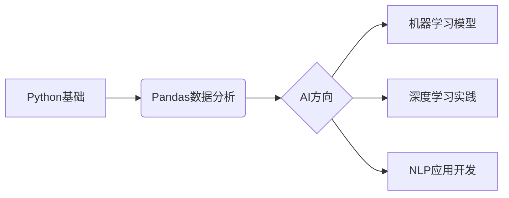
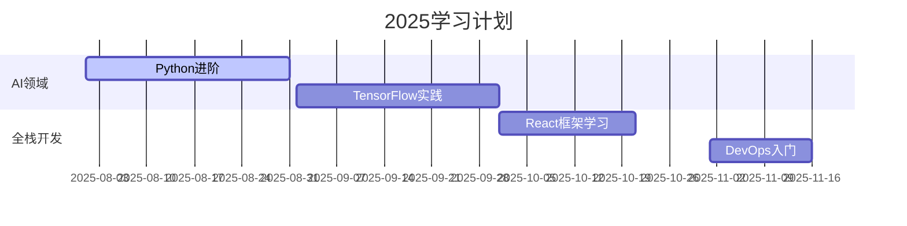

<!-- 动态标题 -->

  
  

---

### 🎓 教育背景
**Diploma in Computer Science**  
[学校名称] | 2022-2025  
📚 主修课程：Web开发 | 数据库系统 | 移动应用开发

---

### 🛠️ 技术矩阵
#### 核心技能

#### 前端专精

#### AI探索

---

### 🚀 项目陈列馆
#### 学术项目
| 项目名称 | 技术组合 | 成果展示 |
|---------|----------|----------|
| [电商平台](link) | PHP+MySQL+Bootstrap | [Demo Video](link) |
| [移动记账App](link) | Kotlin+SQLite | [APK下载](link) |

#### AI实验项目

---

### 📚 学习轨迹

---

### 🌱 成长数据

  
  

---

### 📮 联系通道

  
  
  

